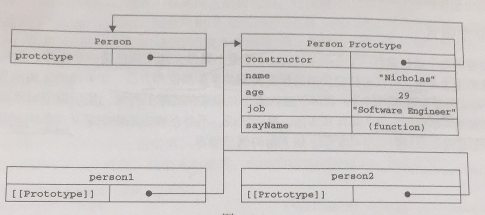

# js原型

## 什么是js原型
每一个function都有一个prototype对象
```js
function Person(value) {
}
console.log(Person.prototype)
```
``` shell
> Person {}
```
### 增加一个属性
``` js
function Person(value) {
}
Person.prototype.value = undefined;
console.log(Person.prototype)
```
``` shell
> Person { value: undefined }
```
### 增加一个函数 
```js
function Person(value) {
}
Person.prototype.value = undefined;
Person.prototype.printValue = ()=>{
    console.log(this.prototype.value);
}
console.log(Person.prototype)
```
``` shell
>Person { value: undefined, printValue: [Function] }
```
### 原型指针结构



